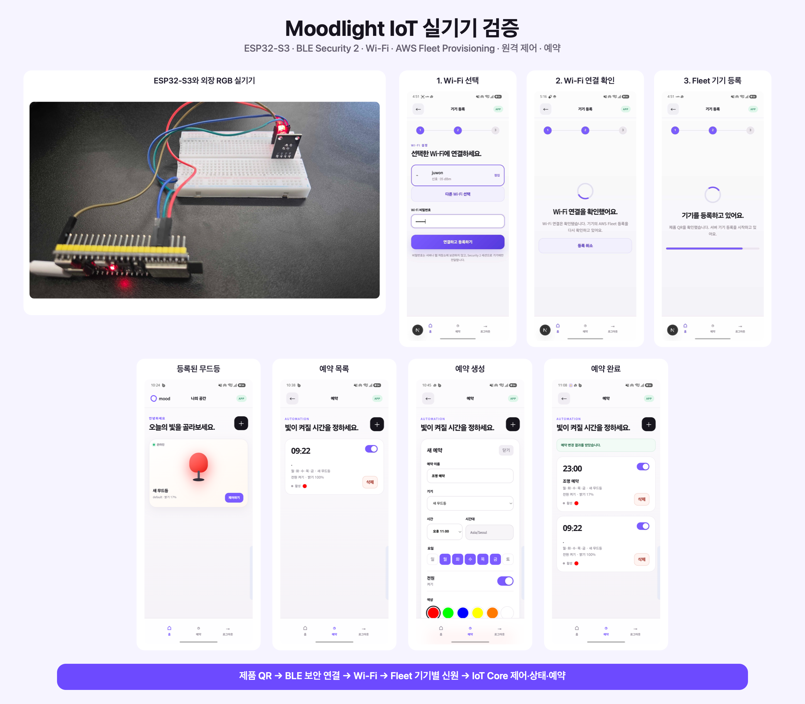
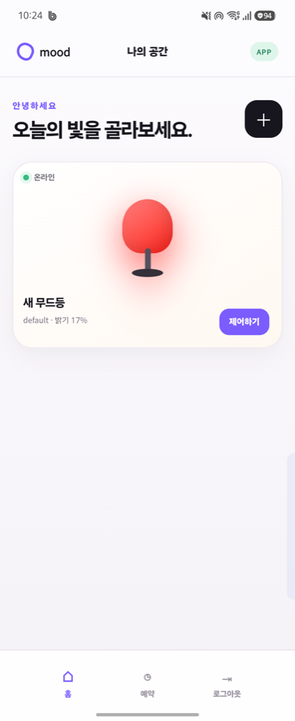
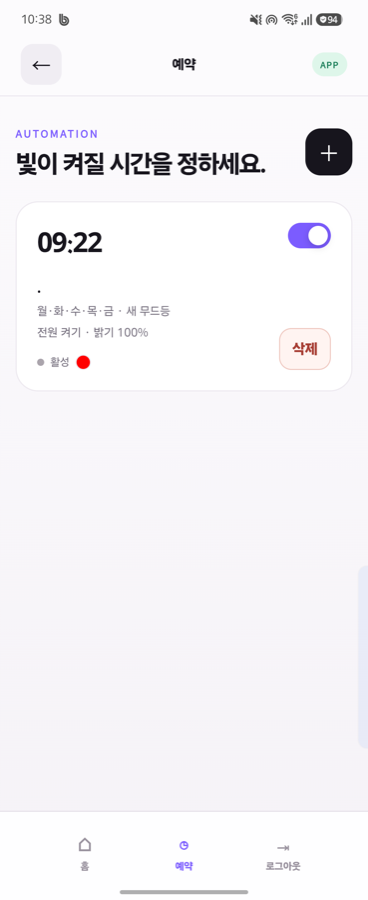
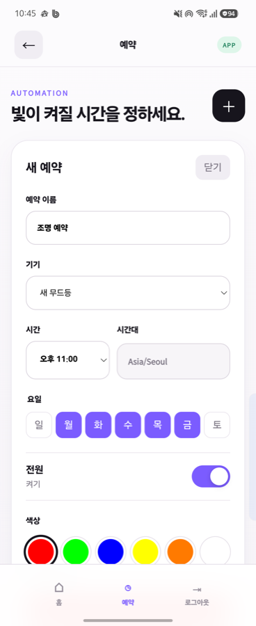
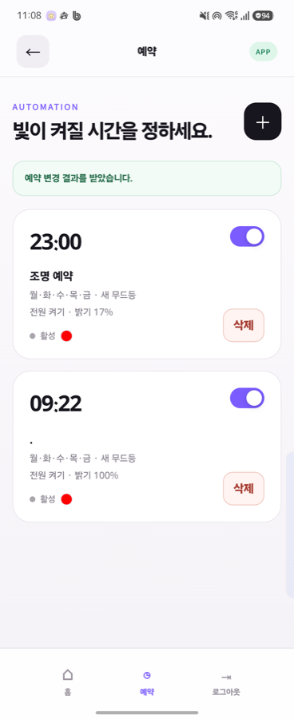
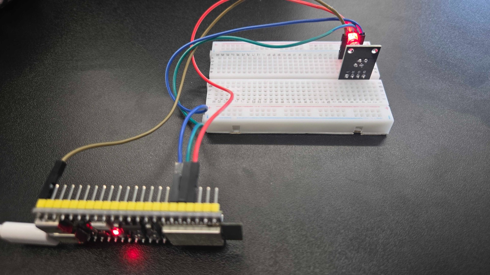
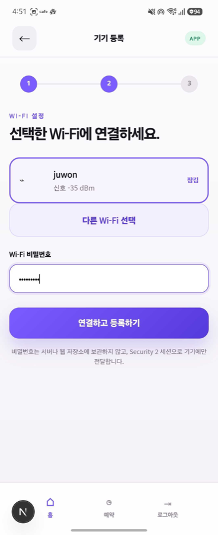
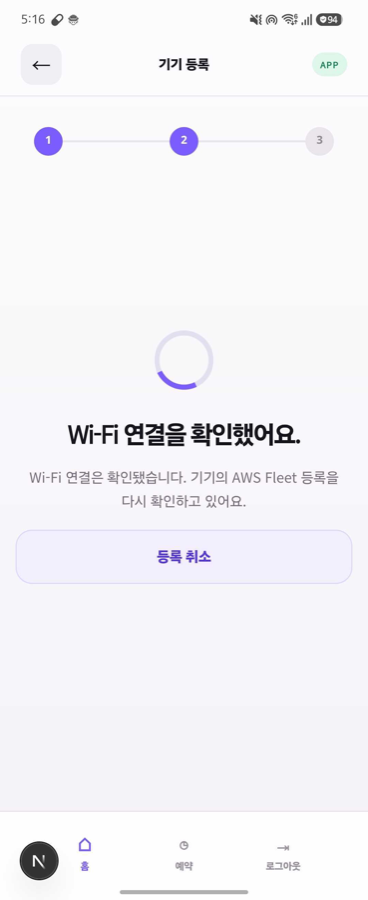
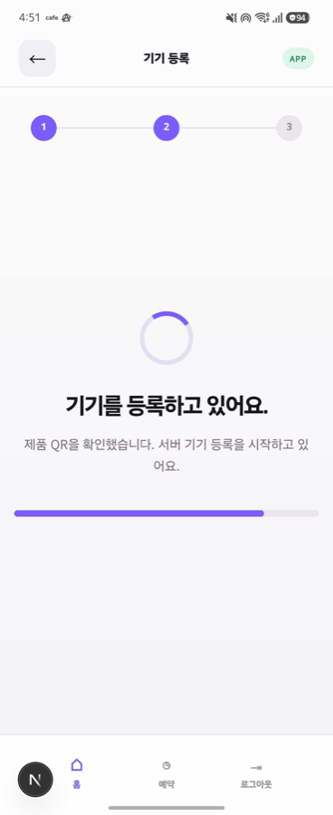

# ESP32-S3 무드등 IoT 토이 프로젝트

> 기기 인증, 메시지 격리, Fleet Provisioning, MQTT, Topic Rule, 서버리스 백엔드를 실제 무드등으로 구현한 IoT 학습 프로젝트

> 보안을 위해 실제 인증정보·배포 환경값·내부 작업 기록을 제외한 공개용 저장소입니다.

- **개발·검증 기간:** 2026-09-03 ~ 2026-09-08 (실작업 4일)

### 목차

- [현재 상태](#현재-상태)
- [주요 앱 화면](#주요-앱-화면)
- [실기기 검증](#실기기-검증)
- [MQTT 토픽 설계](#mqtt-토픽-설계)
- [기능 범위](#기능-범위)
- [KISA IoT 보안인증 사전 검토](#kisa-iot-보안인증-사전-검토)
- [코드 위치](#코드-위치)
- [현재 앱 경계](#현재-앱-경계)
- [격리 배포 원칙](#격리-배포-원칙)



## 현재 상태

2026-09-08 기준, **Cognito 로그인 → BLE Security 2 → Wi-Fi 설정 → Fleet Provisioning → 기기별 X.509·Thing → IoT Core 제어 → 상태 저장 → 예약 실행**을 전용 격리 dev AWS와 실제 ESP32-S3·Android 앱에서 종단간 확인했다. 외장 RGB의 전원·순색·혼합색·밝기와 예약 색상 적용도 실물로 확인했다.

Android `standalone` APK는 Next.js 정적 화면을 안에 포함하여 **Amplify·Metro·휴대폰 USB 없이** 배포된 Cognito·API를 사용한다. ESP32는 별도 전원과 Wi-Fi가 필요하다. 현재 제어는 온라인 `cmd → state`이며, 오프라인 중 명령 자동 복구는 후속 과제다.

| 영역 | 상태 | 다음 확인 |
|---|---|---|
| 제품 흐름 | **실기기 종단 검증 완료** | 로그인 → 제품 QR·BLE Security 2 → Wi-Fi → Fleet → Runtime → 첫 `state` → 제어·상태 수집·예약 |
| MCU 모듈 | 확인 | 실물 각인과 Espressif 데이터시트 기준 `ESP32-S3-WROOM-1-N16R8` — Flash 16MB, PSRAM 8MB |
| 개발 보드 | 높은 신뢰도로 식별 | 사진의 44핀 배열, `COM`·`USB` USB-C 2개, LED·점퍼 배치가 `YD-ESP32-S3` DevKitC-1 호환 보드와 일치. 모듈은 `N16R8`; GPIO48 내장 RGB는 실제 점등 확인. 제조사·회로 revision은 미확인 |
| 외부 RGB 모듈 | **실기기 확인** | 공통 음극 `-→GND`, `R→GPIO4`, `G→GPIO5`, `B→GPIO6`; 순색·혼합색·밝기·소등 확인 |
| 클라우드 | **전용 격리 dev 배포·검증 완료** | 업무용 DynamoDB 7개 + Device Registry 1개(총 8개), Cognito·HTTP API, Lambda, IoT/Fleet·Topic Rule·Scheduler를 고유 접두사와 태그로 분리. 적용 뒤 `No changes` 확인 |
| 구현 | **목표 종단 흐름 완료** | 앱·브리지·QR·Security 2·Wi-Fi, Claim·Registry·Fleet 등록·Runtime 정책 전환, MQTT `cmd/state/tele/evt`, Ingest, 제어·예약 |
| 검증 | **Web 21/21, Mobile 51/51, Backend 101/101, Firmware 28/28, 자격정보 생성기 2/2** 및 타입·빌드 검사 통과. 펌웨어 업로드·flash hash, Terraform 적용 후 `No changes`, 실제 로그인·등록·제어·상태·예약 확인 | 잘못된 QR·변조·재전송 등 부정 시나리오, 소유권 해제→재등록, 오프라인 명령 복구 |

## 주요 앱 화면

| 등록된 기기와 온라인 상태 | 활성 예약 목록 |
|---|---|
|  |  |

| 예약 생성 | 예약 저장 결과 |
|---|---|
|  |  |

## 실기기 검증

외장 공통 음극 RGB 모듈을 ESP32-S3의 GPIO4·5·6에 연결해 전원·색상·밝기 제어를 확인했다.



| Wi-Fi 선택·비밀번호 전달 | Wi-Fi 연결 확인 | Fleet 등록 진행 |
|---|---|---|
|  |  |  |

> 제품 QR, 등록 비밀, 인증서와 계정 정보가 보이는 화면은 저장소에 포함하지 않는다.

시험에는 장소가 바뀌어도 동일한 SSID·비밀번호를 유지할 수 있는 **개인 핫스팟**을 사용했다. ESP32가 저장한 Wi-Fi 설정으로 재등록 없이 자동 재접속하고, 다른 네트워크와 분리된 환경에서 시험하기 위한 선택이다. 핫스팟 사용은 기기 소유권을 정하는 절차가 아니며, 소유권은 Cognito 로그인·Claim·Fleet 등록·첫 runtime `state`로 확정한다.

## MQTT 토픽 설계

같은 AWS IoT Core를 쓰는 프로젝트·환경·Tenant·Pool·기기의 메시지가 섞이지 않도록 다음 주소 형식을 사용한다.

```text
{project}/{env}/tenants/{tenantId}/pools/{poolId}/{thingName}/{kind}
```

| `kind` | 방향 | 역할 |
|---|---|---|
| `cmd` | Lambda → 기기 | 전원·색상·밝기 명령 전달 |
| `state` | 기기 → Ingest | 기기가 실제 적용한 상태 보고 |
| `tele` | 기기 → Ingest | heartbeat·신호 세기·펌웨어 버전 등 운영 정보 |
| `evt` | 기기 → Ingest | 부팅·오류처럼 특정 시점에 발생한 사건 |

기기별 X.509 인증서에 연결된 **IoT Policy**는 자기 Thing 이름으로만 접속하고, 자기 주소의 `state·tele·evt`만 발행하며 `cmd`만 구독·수신하도록 제한한다. **Topic Rule**은 토픽의 4·6·7번째 조각에서 Tenant·Pool·Thing을 추출해 Ingest Lambda로 전달한다. **Ingest Lambda**는 이를 DynamoDB에 등록된 기기 관계와 다시 비교해 일치할 때만 저장한다.

토픽에는 `userId`를 넣지 않는다. 기기 소유자가 바뀌어도 Thing 신원은 유지하고, 사용자 소유 관계는 Cognito 로그인과 DynamoDB의 Membership·Device 데이터로 관리한다. 현재 제어는 온라인 `cmd → state` 방식이며 Device Shadow는 사용하지 않는다.

## 기능 범위

### 이번 범위에서 완료

- Cognito 로그인
- 사용자 한 명당 여러 무드등 등록
- BLE로 주변 무드등 찾기
- 무드등이 검색한 Wi-Fi 목록 표시 및 자격정보 전달
- Fleet Provisioning을 통한 Thing·기기별 인증서·정책 생성
- 기기 목록과 온라인 상태 표시
- 개별 기기의 전원, 색상, 밝기 제어
- 반복 예약 실행
- MQTT `state`·`tele`·`evt` 수집
- 로그, 실패 상태, 인증서 회수 경로 확인

### 후속 범위

- 여러 기기를 한 번에 제어하는 그룹 제어
- 사용자가 만드는 색상 프리셋 저장
- 오프라인 중 명령 복구
- 소유권 해제 후 재등록 및 부정 시나리오 실기기 검증

**등록 반복 시연의 한계:** 최초 BLE 연결·Wi-Fi 설정·Fleet 등록은 실기기로 확인했다. 다만 소유권 해제 후 같은 기기를 다시 등록하는 전 과정은 아직 검증하지 않아 앱의 해제 기능을 제한했다. 서버의 해제 코드는 있지만, 해제 후에는 기존 등록 코드를 재사용하지 못하도록 `REISSUE_REQUIRED` 상태로 전환하며 **새 등록 코드를 발급하는 관리자 도구는 미구현**이다. 따라서 현재 시연은 등록된 기기의 제어·예약 중심이며, BLE 연결 자체가 불가능한 것은 아니다.

## KISA IoT 보안인증 사전 검토

KISA 「정보통신망연결기기등 정보보호인증기준 상세해설서」 **2025.12판**과 현재 코드·시험기록을 대조했다. 확인일은 2026-09-08이다.

> **사전 결론:** 기기별 등록 비밀, BLE 등록 구간 보호, 기기별 X.509 인증서와 MQTT TLS는 향후 인증의 **구현·증적 후보**로 활용할 수 있다. 그러나 저장정보 보호와 부정 시나리오 시험이 남아 있어, 현재 상태를 **인증요건 충족**으로 표현할 수는 없다.

**검토 방법:** 기능 이름만 맞춰 본 것이 아니라, 공식 해설서에서 각 기준의 적용 등급과 요구사항을 먼저 확인한 뒤 펌웨어·앱·AWS 연결 코드와 실제 기기 시험기록을 항목별로 대조했다.

특히 등록 성공 화면만 근거로 삼지 않고, **Wi-Fi 자격정보를 전달하기 전에 대상 기기를 확인하는지**, 최초 AWS 등록에 쓰는 공용 Fleet Claim이 이후 **기기별 인증서와 제한된 운영 권한으로 전환되는지**를 하나의 보안 흐름으로 확인했다.

| 한눈에 보는 판정 | 내용 |
|---|---|
| **활용 가능한 부분** | 기기별 QR 등록 비밀, ESP-IDF Security 2, 기기별 X.509 인증서, MQTT TLS, 보안 권고를 반영한 ESP-IDF 버전 갱신 기록 |
| **가장 큰 보완점** | Wi-Fi 자격정보와 기기 개인키를 보관하는 NVS/Flash의 저장 암호화 또는 이에 준하는 보호 수단이 아직 적용·입증되지 않음 |
| **추가 시험** | 잘못된 QR, 변조, 재전송, 반복 인증 실패가 실제로 차단되는지 버전·절차·결과를 남기는 시험 |
| **인증 준비 시 결정** | 인증 대상 범위와 목표 등급. 공식 기준은 기기 **Lite·Basic·Standard** 및 연동 앱 **Basic**에 따라 적용 항목이 다름 |

**증적**은 보안 기능이 실제로 작동함을 보여 주는 자료다. 설명만 적는 것이 아니라 **적용 코드·설정, 시험 절차, 실제 결과, 확인 방법**을 기준 번호와 연결해야 한다.

| 공식 기준 | 현재 구현과 판정 | 추가로 준비할 증적 |
|---|---|---|
| **1.3 기기 인증**<br>기기 Basic 및 Standard | 기기별 QR 등록 비밀로 BLE 상대를 확인하고, 등록 후에는 기기별 X.509 인증서로 AWS IoT에 연결한다.<br>**판정: 활용 가능.** 정상 등록은 확인했지만 거부 경로는 미검증이다. | 다른 기기·잘못된 QR·재사용 시도의 거부 결과, 등록 비밀 생성·주입·폐기 절차 |
| **2.1 전송정보 보호**<br>모든 기기 등급 및 앱 Basic | BLE 등록 구간은 Security 2의 AES-GCM, 운영 구간은 MQTT TLS를 사용한다.<br>**판정: 부분 입증.** 정상 통신은 확인했지만 변조·재전송 차단은 미검증이다. | 프로토콜·버전·암호 설정·키 처리 명세, 변조·재전송 시험 결과 |
| **2.2 저장정보 보호**<br>모든 기기 등급 및 앱 Basic | Wi-Fi 자격정보와 Fleet 기기 인증서·개인키를 NVS/Flash에 저장한다.<br>**판정: 보완 필요.** 현재 저장 암호화와 이에 준하는 보호 수단이 입증되지 않았다. | NVS 암호화·안전한 저장영역·접근통제 중 선택한 보호 설계와 실기기 확인 결과 |
| **3.1 안전한 암호 알고리즘**<br>모든 기기 등급 및 앱 Basic | AES-GCM과 TLS 기반 구현을 사용한다.<br>**판정: 명세 필요.** 알고리즘 이름만으로 전체 기준 충족을 판단할 수 없다. | 실제 알고리즘·키 길이·라이브러리 버전·설정과 시험 결과 |
| **4.4 알려진 취약점 조치**<br>모든 기기 등급 및 앱 Basic | Security 2 관련 공개 보안 권고를 확인해 ESP-IDF v5.5.5로 갱신하고 재빌드·실기기 재시험을 수행했다.<br>**판정: 활용 가능.** 취약점 관리 과정을 보여 주는 한 사례다. | 사용 버전 목록, 영향 분석, 조치 커밋·빌드 식별값, 조치 전후 시험 결과 |

**공식 근거와 확인 위치**

- [KISA 제도 안내](https://www.kisa.or.kr/1050608): 인증 대상과 등급 안내
- [상세해설서 배포 게시물](https://www.ksecurity.or.kr/user/bbs/kisis/92/539/bbsDataView/19547.do) · [PDF 원문](https://www.ksecurity.or.kr/common/proc/kisis/bbs/92/fileDownLoad/3625.do)
  - 등급별 적용 기준: 12쪽부터 14쪽
  - 준수명세서와 증빙자료 작성 방법: 17쪽
  - 기기 인증: 28쪽부터 30쪽
  - 전송·저장정보 보호: 37쪽부터 42쪽
  - 안전한 암호 알고리즘: 52쪽부터 54쪽
  - 알려진 취약점 조치: 71쪽부터 72쪽
- [Espressif 공식 보안 권고 GHSA-9r76-858f-v6jh](https://github.com/espressif/esp-idf/security/advisories/GHSA-9r76-858f-v6jh): ESP-IDF v5.5.5 갱신 근거

**주의:** ESP-IDF Security 2와 KISA 해설서의 Bluetooth 보안모드 2는 서로 다른 개념이다. Security 2를 사용한다는 이유만으로 Bluetooth 링크 계층이나 인증 기준 전체를 충족한다고 판정하지 않는다. 최종 적합 여부는 목표 등급의 전체 기준과 인증시험 결과로 판단한다.

## 코드 위치

```text
moodlight-iot-showcase/
├── README.md          프로젝트 소개·구현 범위·실행 화면
├── webapp/app/        사용자가 보는 웹 화면
├── mobile/            웹 화면을 담는 Android 앱·휴대폰 기능
│   ├── App.tsx        앱 진입점
│   ├── src/           로그인·브리지 등 앱 로직
│   └── modules/       네이티브 기능 모듈
├── firmware/main/    ESP32에서 실행되는 기기 프로그램
├── backend/src/      등록·소유권 확인·제어·상태 수집·예약 처리
└── infra/            AWS 리소스와 권한을 정의한 Terraform
```

**코드 읽는 순서:** `webapp/app/`에서 화면 흐름 → `mobile/`에서 휴대폰 기능 연결 → `backend/src/`에서 요청 처리 → `firmware/main/`에서 기기 동작 → `infra/`에서 AWS 구성·권한 확인. 위 트리는 주요 코드 폴더만 표시했다.

| 폴더 | 현재 기술 | 역할 |
|---|---|---|
| `webapp/` | Next.js 정적 웹앱 | 로그인, 기기 홈, 제어·예약 화면과 등록 화면 흐름 |
| `mobile/` | React Native·Expo Android 앱 | 독립 APK, WebView 컨테이너, Cognito PKCE, BLE 권한·검색·Security 2·Wi-Fi, 네이티브 브리지 |
| `firmware/` | ESP-IDF | RGB LED, BLE, Wi-Fi, Fleet Provisioning, MQTT |
| `backend/` | TypeScript·AWS Lambda | 소유권·Claim, Registry 1회 소비, Fleet finalize, 명령·수집·예약·해제와 AWS 어댑터. 전용 격리 dev에서 Fleet·Runtime·제어·상태 수집·예약 종단 검증 완료 |
| `infra/` | Terraform | 기본 OFF 안전 guard와 격리 dev DynamoDB·Cognito·HTTP API·Lambda·IoT/Fleet·Registry·Hook·Rule·Scheduler 선언. 실제 설정값은 Git에서 제외하고 필요한 단계만 활성화 |

## 현재 앱 경계

| 현재 구현·확인 | 남은 검증 |
|---|---|
| Next.js 정적 화면을 포함한 독립 APK와 검증된 Native Bridge | Amplify를 이용한 원격 웹 배포·업데이트 |
| Cognito Authorization Code + PKCE 로그인, Native 토큰 보관, JWT API 호출 | 장시간 토큰 만료·갱신 시험 |
| 제품 QR → BLE Security 2 → Wi-Fi → Claim·Fleet → Runtime 정책 → 첫 `state`·ONLINE | 잘못된 QR·변조·재전송·중단 후 재연결·잘못된 Wi-Fi 등 부정 시나리오 |
| 기기별 전원·순색·혼합색·밝기 제어와 적용 상태 확인 | 소유권 해제→인증서 정리→같은 기기 재등록 종단 시험 |
| EventBridge Scheduler 예약과 실제 기기 적용 | 오프라인 중 명령 자동 복구 |

> 실제 모드는 가상 데이터나 가짜 성공을 표시하지 않는다. Wi-Fi 설정은 현재 등록 시도·선택 기기·Security 2 세션이 모두 일치할 때만 Native가 전달한다. 앱의 Wi-Fi 연결과 서비스의 ONLINE 등록은 별도 단계이며, 후자는 Fleet·서버 소유권 결속·첫 runtime `state`까지 완료되어야 한다.

## 격리 배포 원칙

- 개인 식별용 project token·`dev` 환경·공통 태그를 모든 리소스에 적용했다.
- Terraform 저장 계획에서 다른 프로젝트 리소스의 변경·삭제가 없는지 확인한 뒤 적용했다.
- 적용 뒤 전체 plan의 `No changes`를 확인했다.
- 실제 계정 번호·ARN·endpoint·인증서·QR 비밀·Terraform state는 Git에 올리지 않는다.
- 자동 생성된 Thing·기기 인증서와 Terraform 밖 Claim 인증서는 정리 목록에서 별도로 추적한다.
